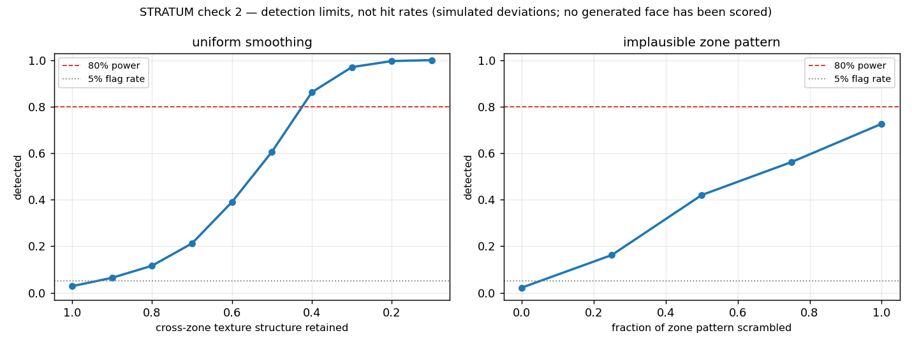
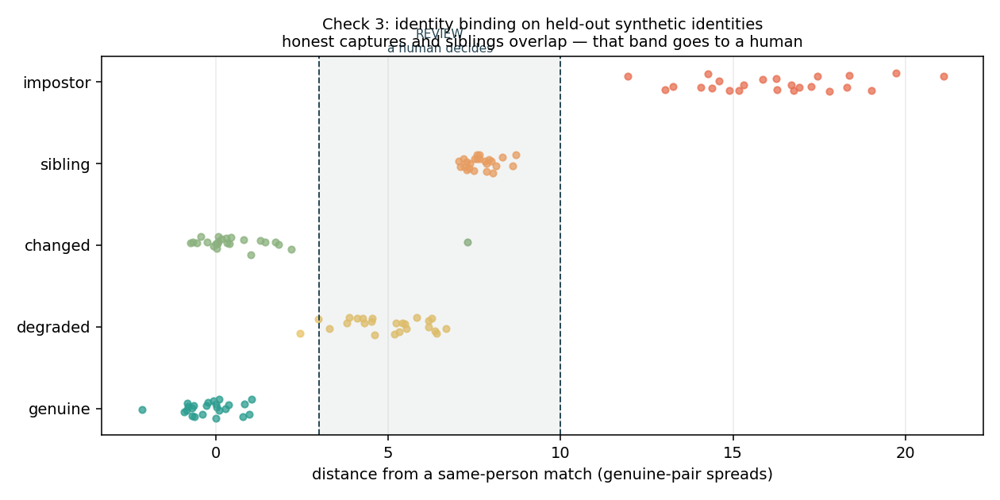

# STRATUM

**An agent can do the whole task. It cannot do the last part.**

STRATUM is a WebMCP tool surface for the moment an action stops being
reversible. The page registers tools that let an agent work a treasury desk
properly, and one tool, `release_funds`, that is published precisely so that
its boundary is visible rather than discovered. It always refuses a non-human
caller, and it returns the reason and the name of the tool to call instead.

Built for **The WebMCP Challenge** (OpenAI, Cloudflare, Vercel, Shopify,
Chrome, Render, Netlify).

- **Live desk:** https://stratum-two-chi.vercel.app
- **How the boundary is enforced:** https://stratum-two-chi.vercel.app/how
- **Audit service:** https://stratum-verifier.onrender.com/health

Open the live URL in ChatGPT's in-app browser, or in Chrome with
`chrome://flags/#enable-webmcp-testing` enabled, and the tools register
automatically. There is also a local driver in the page for anyone on an
ordinary browser: it calls the identical `execute` functions.

---

## The problem this is about

Agents are being handed real sessions on real accounts. Search the catalogue,
add to the cart, book the table: a tool surface makes all of that faster and
more reliable than guessing at a UI, and that is the point of the standard.

STRATUM is about the step after those. The moment an action becomes
irreversible, a web app has two options today and both cost something real:

1. **Leave the capability in the page.** Anything holding the session can fire
   it, including an agent that has misread the task.
2. **Hide the capability.** Now the agent cannot see the boundary, treats the
   failure as a bug, and starts looking for a way around it. Hidden boundaries
   are what produce retries, scraped forms and synthetic clicks.

STRATUM takes a third option. The irreversible tool is **registered, fully
described, and always refuses**, and the refusal is a normal return value that
names the remedy:

```json
{
  "refused": true,
  "error": "HUMAN_REQUIRED",
  "message": "Refused because the caller is an agent. This is not a permissions
              misconfiguration and retrying will not change it.",
  "next_tool": "request_human_confirmation",
  "next_tool_input": { "action_id": "inv-2310" }
}
```

A tool surface should be able to teach an agent where its authority ends, in
the same structured channel it uses to teach it everything else.

## How WebMCP is implemented

All ten tools are registered in
[`frontend/src/webmcp/tools.js`](./frontend/src/webmcp/tools.js) when the desk
mounts, and unregistered when it unmounts, because a treasury desk that is no
longer on screen should not still be offering itself to an agent.

```js
document.modelContext.registerTool({
  name: "release_funds",
  description:
    "Release a staged payment, or execute a staged signature. This tool is " +
    "published so that its boundary is visible rather than discovered: it is " +
    "real, it is understood, and it always refuses a non-human caller. " +
    "Call request_human_confirmation instead.",
  inputSchema: {
    type: "object",
    properties: { action_id: { type: "string" } },
    required: ["action_id"],
  },
  execute: async ({ action_id }) => ({
    refused: true,
    error: "HUMAN_REQUIRED",
    next_tool: "request_human_confirmation",
  }),
});
```

| Tool | What it is for |
|---|---|
| `list_pending_actions` | Read the desk. Returns each item with the risk tier this site assigns it. |
| `inspect_action` | One action in full, including why it sits in its tier. |
| `stage_action` | Validate, price, and put an action in front of the human. Moves nothing. |
| `search_products` | Search the connected Shopify store through the Storefront API. Read only. |
| `build_cart` | Create and price a real Shopify cart. **The checkout URL is withheld.** |
| `release_funds` | **Registered and always refused.** The visible boundary. |
| `request_human_confirmation` | The handoff. Opens the gate in-page, returns `PENDING_HUMAN`. |
| `check_confirmation` | Poll for the outcome. The agent may watch and cannot resolve. |
| `get_receipt` | The sealed record: who confirmed, at what depth, when. |
| `verify_record` | Recompute the audit chain and report whether it was altered. |

## The same boundary on somebody else's infrastructure

The Shopify half is in the project because it shows the pattern holding where
we do not control the backend, and where the boundary is structural rather than
something this app merely asserts.

The Storefront Cart API has no payment capability in it. `cartCreate` and
`cartLinesAdd` build and price a cart and neither of them can charge a card.
The only route to an actual payment is `cart.checkoutUrl`, a hosted page on
Shopify's own domain. So an agent holding a cart is not being trusted to behave
itself: it is holding an object that cannot take money.

`build_cart` returns the line items and the subtotal, and withholds that one
field. The URL is kept in a module-private `Map` keyed by cart id in
[`shopify.js`](./frontend/src/webmcp/shopify.js) that no registered `execute`
function reads from, and it is released to the browser only after a human
settles the gate. The card details are then entered on Shopify's page, never in
this app and never by the model.

A Storefront access token is public by design, which is why the page can prompt
for one safely. Leave it blank and a five item demo catalogue drives the same
flow with no store and no network.

## Proportionate friction

A twelve dollar renewal and a forty thousand dollar wire should not cost the
same. Charge maximum friction everywhere and people switch it off, which is how
a control ends up protecting nothing. So the depth of the check is derived from
the action, in [`actions.js`](./frontend/src/webmcp/actions.js), and never
supplied by the caller. A caller that can name its own risk tier has not been
tiered at all.

| Tier | Trigger | Depth |
|---|---|---|
| **Light** | under 500, known payee | A present human, in this tab, on a real input event |
| **Standard** | 500 and up, or a new payee | A live challenge this page issues |
| **Critical** | 10,000 and up, or legally binding | Presence, authenticity, and binding to the enrolled signer |

## What stops a script

The confirmation buttons are the only path to a settled action, and no
registered tool can reach them. A click dispatched from JavaScript arrives with
`event.isTrusted === false` and is refused and logged.

This is deliberately not overclaimed. `isTrusted` is a real property a page
script cannot forge, and it is not a complete defence against a browser
extension or a driver at the CDP layer. The critical tier is where the actual
assurance lives: presence, authenticity, and binding to an enrolled human,
which is the verification engine documented in the rest of this file.

## Honest limitations

- Every face in the presence gate is **synthetic**. The numbers measure the
  matcher, not real skin, and that caveat is printed on the certificate.
- The audit service runs on a free instance that sleeps. Every call to it from
  the desk is best effort with a timeout, and the boundary is enforced locally
  as well as remotely, so a cold backend degrades the evidence trail and never
  the refusal.
- WebMCP is an emerging standard. The tool surface here targets the imperative
  `document.modelContext.registerTool` API as documented by Chrome.

## Licence

MIT. See [LICENSE](./LICENSE).

---


## Quick start

**Requires Python 3.13.** Python 3.14 has no scipy/opencv wheels yet and will try to build from source.

```bash
make setup           # creates .env, installs verifier + frontend deps
make seed            # synthetic fixtures — pipeline runs before credentials land
make test            # verifier unit tests — offline, no API calls
$EDITOR .env         # fill in credentials as they arrive
make smoke           # verify every sponsor credential
make dev             # verifier :8000 + frontend :5173 (HTTPS)
```

`STRATUM_API_MODE=replay` is the **default**. Nothing calls a real API until you opt in. See *Credit discipline* below — this matters more than it looks.

### Running a capture

```bash
make capture IMG=path/to/face.jpg              # replay — free, offline
make capture IMG=path/to/face.jpg MODE=auto    # records real responses, SPENDS UNITS
```

Writes a derived bundle to `fixtures/derived/<name>.json` (scores, face
attributes, spot constellations) and a constellation scatter plot to
`benchmark/`. Once recorded, the same command replays forever at zero cost.

If you have no image, `make seed` generates a synthetic face plus matching
fixtures, and `make capture` with no arguments runs against them.

### The authorisation boundary

```bash
make gate-demo    # an agent driving a $250k transfer, refused at the boundary
make schema       # the 9-table data model, ready to create in Xano
```

`gate-demo` walks a gate through its whole lifecycle, shows the agent refused
twice with 409, shows a human succeeding at the identical move, then verifies
the hash chain and breaks it by tampering with one event.

The rule that makes this true lives in exactly one place — `TRANSITIONS` in
`verifier/gate.py`. Every transition names the actors allowed to make it, and
no transition into `SIGNED` accepts `agent`. `tests/test_gate.py` proves the
graph has no agent-only path to `SIGNED` at all, rather than testing a few
examples of it.

Xano is the system of record in production. `verifier/store.py` implements the
identical schema and identical rules locally, so the logic is testable before
the Xano instance exists and the function stack has a reference to be checked
against rather than being the only copy.

### Does one face separate from another?

```bash
make separation   # measured distances, same person vs different people
```

Everything downstream assumes two captures of one face land closer together
than two captures of different faces. That assumption is measured, not stated:

| channel | same person | different people | separated |
|---|---|---|---|
| identity (stable scores) | 0.227 | 1.363 | ✅ |
| facial ratios | 0.030 | 0.277 | ✅ |
| pore constellation | 0.249 | 0.853 | ✅ |
| volatile scores *(control)* | 1.347 | 1.168 | ❌ *by design* |

Volatile is the control. It is *expected* to fail — it is redrawn every capture,
which is precisely why it is excluded from identity and used only for liveness.
If it ever separated, the stable/volatile split would be wrong.

These numbers come from a synthetic cohort (`verifier/synth_cohort.py`) and the
report says so on every run. They show the mathematics works; they say nothing
about real skin until the Step 12 genuine set replaces them.

Three findings from getting there, kept because they cost real time:

- **Chamfer distance cannot carry identity.** With ~70 points in a unit disc the
  mean nearest-neighbour distance is ~0.15 whichever points you pick, so two
  strangers score almost as well as two captures of one person.
- **Independent framing is not accurate enough.** A different detection subset
  moves the principal axis by ~8°, and the area-weighted centroid moved the
  origin by up to 0.26 — five times the matching radius. Both clouds must be
  registered *against each other*, not framed separately and compared.
- **A four-parameter fit always finds something.** Fitting a similarity
  transform to maximise overlap aligns part of two unrelated clouds no matter
  what, so position alone is not enough. Matching also requires agreement on
  relative spot size, which unrelated constellations have no reason to show.

`POST /verify` returns the normalised vectors; `POST /verify/compare` returns
per-channel distances. Neither returns a verdict — thresholds are Steps 5-7, and
a caller that cannot see *which* channel disagreed cannot tell a bad camera
angle from an impostor.

### Is a live human in front of the camera?

```bash
make presence     # measured rejection rates, by attack medium
```

The server hands the client a nonce. The colour sequence and the head turn are
derived from it by HMAC, so the spec is regenerated on every call rather than
stored — there is no server state to race, and nothing the client sends can
influence what it was supposed to do. The predictions are never sent to the
client: telling it which way each score must move is telling a forger what to
fake.

Four independent signals, and the verdict is their **conjunction**, not a
weighted average:

| signal | question | catches |
|---|---|---|
| illumination | did the volatile scores move the way this nonce says? | replay, injection |
| pose | did the face turn the way this nonce asked? | recordings turned the wrong way |
| timing | did the response arrive after the challenge, in its window? | stale sessions |
| geometry | does the face have depth, or is it flat? | printed photographs *(partially)* |

Measured over 60 simulated sessions per medium:

| medium | accepted | illum | pose | timing | depth | |
|---|---|---|---|---|---|---|
| live human | **90%** | 97% | 97% | 100% | 97% | ✅ accept |
| printed photo | 25% | 97% | 100% | 100% | 27% | ⚠️ known gap |
| phone screen | **0%** | 2% | 100% | 100% | 27% | ✅ reject |
| injected stream | **0%** | 0% | 97% | 100% | 97% | ✅ reject |

Why more than one signal is needed is a physics argument, not a heuristic one:

- An **injected stream** — OBS replaying a genuine session — is a recording of a
  real 3D face, so depth cannot see it (97% of injections pass the depth
  signal). It cannot know what colour the screen flashed 200 ms ago, so
  illumination rejects every one.
- A **printed photo** genuinely reddens under a red-dominant flash and can be turned on
  cue, so illumination and pose both clear it. It is flat, so depth catches
  most of it — 97% → 27%. **Not all of it.** That gap is stated in every API
  response, not just here.

Averaging these would let an injected stream through on the strength of its
excellent geometry. `PresenceResult.score` is the *minimum*, and an undecided
session scores **0.0, not 0.5** — absence of a response is the injection
signature, not a neutral result.

Three findings worth the time they cost:

- **The deadband calibrates itself.** Stable dimensions must not respond to
  light, so their frame-to-frame spread *is* this session's noise floor —
  measured from the check's own control, needing no extra frame. A noisy capture
  therefore widens the deadband, decides fewer predictions, and makes the check
  *abstain* rather than guess.
- **Three frames could never have worked.** Only same-pose frames are
  comparable, so `n` frames give C(n-1, 2) pairs: 1 at three frames, 6 at five.
  At three the check cannot reach its own evidence bar and abstains on every
  session, honest and attacker alike. `derive()` now refuses fewer than five.
- **A tight matching radius destroys the depth signal.** Registering the posed
  frame at the identity radius of 0.05 discards exactly the pores that parallax
  displaced. The depth check was rejecting the evidence it existed to find —
  it passed 55/60 *printed* sessions and 22/60 live ones, precisely inverted.

**How good does the real API have to be?** `ILLUM_EFFECT` — how far a coloured
flash moves a skin score — is unmeasured without credentials, so rather than
assert a guess, `make presence` sweeps it:

| flash response | ÷ noise | live accepted | injection accepted | |
|---|---|---|---|---|
| 2.0 pts | 1.3× | 10% | 0% | too weak |
| 4.0 pts | 2.7× | 53% | 0% | too weak |
| 6.0 pts | 4.0× | 80% | 0% | too weak |
| 8.0 pts | 5.3× | 90% | 0% | usable ← assumed |
| 12.0 pts | 8.0× | 93% | 0% | usable |

So check 1 needs a flash to move a volatile score by **≥5.3× its own
frame-to-frame noise** — a concrete acceptance criterion for Step 12 to confirm
or refute. The assumed value sits exactly on that boundary, which is the least
comfortable number in this repository and the reason it is printed rather than
buried. Note that injection is rejected at *every* effect size: below the
threshold the check abstains and fails closed, it does not start accepting
attacks.

Every figure above comes from `verifier/synth_attacks.py`, a physical
simulation. **No physical presentation attack has been run** — that needs a
camera and sponsor credentials, and is Step 12. These numbers are evidence the
physics works, not evidence the attacks were defeated in the room.

`POST /challenge` issues a spec; `POST /check/presence` judges a response and,
given a `gate_id`, writes the verdict to `evidence` with the signal that
triggered it — a reviewer needs to know *which* physics failed.


### Are these pixels camera-native, or generated?

Check 2 (`make authenticity`). Perfect Corp's HD analysis returns pore scores
for three facial zones and wrinkle scores for six. The hypothesis, stated before
it was tested: a generated face diverges from a real one more in the *structure*
of those per-zone scores than in their average. So the average is the one
statistic the check ignores.

Two one-sided tests, because they catch different forgeries and neither subsumes
the other:

| signal | asks | tail | catches |
|---|---|---|---|
| `contrast` | is there *enough* structure across zones? | lower | uniform over-smoothing |
| `zone_pattern` | is the structure in the *right places*? | upper | anatomically implausible profiles |

Halving every zone's departure from its face mean is caught 97% of the time by
`contrast` and 1% by `zone_pattern`. Scrambling which zone holds which value is
caught 73% by `zone_pattern` and far less often by `contrast`. One statistic
would have missed whichever failure it was not shaped for.

Three decisions that a naive version gets wrong:

- **Normalise per zone, not against a pooled baseline.** A face's zone scores
  are not draws from one distribution — the nose is anatomically more porous
  than the cheek *in everyone*. Testing them against a pooled genuine baseline
  rejects real people for having a normal T-zone.
- **Calibrate on the empirical null.** These statistics are neither normal nor
  independent, so a chi-square with an assumed number of degrees of freedom
  would not hold its false-positive rate. Each threshold is a quantile of the
  statistic's own distribution over genuine faces, exact by construction.
- **Calibrate on faces you did not fit on.** Zone means are estimated on half
  the reference cohort and the null measured on the other half. Sharing them
  cost about two points of false-positive rate — 7.2% measured against a 5.0%
  advertised rate — because every face contributes to the mean it is then
  compared against.

The 5% flag budget is *split* across the two tests, 2.5% each. Two one-sided
tests at 5% apiece would flag nearly 10% of genuine users, which is the
multiple-comparisons mistake that makes a forensic tool look decisive while it
is merely trigger-happy. Measured on 800 held-out genuine faces: **3.6% flagged
against a 5.0% budget.**

#### Why this section reports a detection limit and not a hit rate

Check 1's simulator is defensible because it encodes theorems and physics: a
flat plane's homography residual is exactly zero, and light reflecting off skin
changes measured radiance. **Check 2 has no equivalent.** "Generated faces score
differently on a skincare CNN" is an unverified empirical claim. Building a
simulator that makes generated faces smoother, then showing the check detects
smoothness, measures nothing at all — it is a fabricated positive.

So `verifier/synth_zones.py` is split deliberately. Its genuine model encodes
**anatomy** — the T-zone is oilier and more porous than the cheeks, a
dermatological fact as safe as check 1's 25 mm of facial relief. Its deviation
model encodes **nothing about real generators**: it is a ruler with a knob, two
free parameters that get swept. At the knob's neutral setting the output is
drawn from exactly the genuine distribution, which is what makes the
false-positive figure above meaningful.

What that buys is a **detection limit**:

> A face must lose **more than 58%** of its cross-zone texture structure before
> check 2 catches it 80% of the time. Anatomically implausible zone patterns
> never reach 80% power at all — even a completely scrambled profile is caught
> only 73% of the time. Nine zones, four of them bilateral pairs, is not much to
> test a distribution's shape with.



**No synthetic face and no Perfect Corp face-swap has been scored.** Both need
credentials that have not arrived. Whether real generators exceed the limit
above is genuinely unknown, and it is Step 12's job to settle — the limit is
stated in a form that a single afternoon with real samples can confirm or
refute.

Checks 1 and 3 do not depend on this one. If Step 12 shows real generators sit
below the detection limit, check 2 is reported as a measured negative and the
system stands on presence and binding.

`POST /check/authenticity` judges a capture. An SD capture carries no per-zone
breakdown, so the check returns `ran: false` and **does not pass** — check 3
must be able to tell "looked and was satisfied" apart from "could not look", or
a downgrade to SD becomes a free bypass.

---

### Is this the person who enrolled?

Check 3 (`make binding`). Three channels, fused by measured separation rather
than by intuition: where the spots sit (0.60), the proportions of the face
(0.28), and the slow-moving skin scores (0.12). A channel that cannot be
computed is **dropped and the remaining weights renormalised** — scoring an
absent channel as agreement would let a degraded capture manufacture a match.

Two thresholds, not one, and they are placed around an overlap rather than
inside it. Held out from the identities the thresholds were fitted on:

| population | mean | sd | range | PASS | REVIEW | FAIL |
|---|---|---|---|---|---|---|
| genuine | −0.20 | 0.71 | [−2.15, 1.04] | 24 | 0 | 0 |
| degraded capture | 4.95 | 1.14 | [2.43, 6.69] | 2 | 22 | 0 |
| changed appearance | 0.69 | 1.58 | [−0.73, 7.30] | 23 | 1 | 0 |
| sibling | 7.68 | 0.44 | [7.05, 8.69] | 0 | 24 | 0 |
| impostor | 16.20 | 2.18 | [11.94, 21.10] | 0 | 0 | 24 |

**0 of 72 honest captures were auto-rejected. 0 of 48 attacks were auto-passed.**

The interesting number is the one in between. The worst honest capture reaches
7.30; the nearest sibling starts at 7.05. Those two populations **overlap**, so
no threshold separates them, and sweeping a single threshold shows what that
costs:

| threshold | attacks caught | honest wrongly rejected |
|---|---|---|
| 7.0 | 100% | 1% |
| 8.0 | 60% | 0% |

At 7.0 you catch everything and start turning away real people. At 8.0 you stop
turning people away and miss 40% of attacks. There is no value that does both —
so the band between 3.0 and 10.0 is handed to a human instead of guessed at.
That costs **32% of honest captures a human review**, and it is a price paid
deliberately: a wrong rejection stalls a transaction, a wrong approval moves the
money, and the two are not worth the same.



**The plan's stated reason for the REVIEW band was wrong.** It assumed relatives
would need review because they *look* alike. They do land in REVIEW — but the
spot constellation separates them cleanly, because moles form stochastically in
development rather than being inherited. What actually forces the band is that
badly-lit genuine captures reach further than close relatives do. The finding is
pinned by a test so it cannot quietly disappear if the numbers move.

Every figure here describes the **matcher**, not faces. The cohort is synthetic
and its identities carry distinct spot patterns by construction, so measuring
that they come out distinct measures the code working as written. Step 12's
genuine set is what decides whether real skin separates.

`POST /check/binding` judges a probe against a named enrolment.

---

### Turning three checks into one decision

`POST /decide`. A conjunction, not a weighted average. A perfect identity match
on an injected video stream is not two-thirds of an authorisation; it is a fraud
with good lighting, so a strong result on one check can never compensate for a
violated one. A score is reported so a review queue can be sorted, but it never
overrides a check.

The distinction the layer exists to protect is between **failed** and **did not
run**. A check that could not run has produced no evidence, and treating that as
a pass turns every capture degradation into a bypass — ask for SD analysis and
check 2 vanishes silently. So an absent check sends the gate to REVIEW.

That rule has a sharp edge which the tests caught: leaving a check out of the
request entirely was, at first, *safer* than honestly reporting that it could not
run. The caller was rewarded for staying quiet. All three checks must now be
accounted for, and both routes lead to REVIEW.

A decision against a gate is written through `gate_transition` — the same choke
point every other state change uses. Fusion gets no private door into
`gates.state`, so its verdicts obey the same legality rules and land in the same
hash-chained audit log as everything else.

---

### The attestation certificate

Doctavian's job (`context.md` §7.7) is to turn a variable-length, conditional
evidence graph into a single legally-shaped document: one template, every
jurisdiction and every outcome. Three things vary independently —

| varies | why it changes the document |
|---|---|
| jurisdiction | EU AMLR and US CIP require different disclosures. A certificate making an EU claim under US rules is worse than no certificate |
| risk tier | enhanced diligence requires the evidence enumerated, not summarised |
| outcome | PASS, REVIEW and FAIL are three *different documents*, not one document with a word swapped |

The rule that governs the whole module: **the certificate states what was not
established.** An attestation is a liability instrument — whoever relies on it
inherits its claims — so overstating is a legal exposure rather than a
marketing decision. Every check's measured limit is transcribed into the
document itself: check 2's detection limit, check 3's overlap, and any check
that did not run, explicitly flagged as *not* a negative finding.

A REVIEW certificate is written so it cannot be mistaken for a PASS. It records
that the automated evidence did not settle the question, that a named person
decided, and that the conclusion carries that person's fallibility rather than
a measured error rate.

Refused transitions stay in the timeline. An agent that tried to sign and was
stopped is the single most interesting event an auditor can find, and a
certificate that drops it is describing a different gate.

**The verdict is recovered from the audit trail, not read from the gate.** The
certificate is issued on the signature webhook, by which time the gate has moved
to `SIGNED` and then `SEALED` — so its current state is no longer a verdict at
all. Reading it directly reported every signed gate as "Indeterminate" and
erased the difference between a clean PASS and a REVIEW that a human chose to
approve, which is the most important distinction on the document. The verdict is
therefore taken from the last transition into PASS/REVIEW/FAIL in the
hash-chained trail: the same evidence an auditor would use, read the same way.
Found by running the pipeline end-to-end rather than by a unit test.

**Auth was not what either source said.** `context.md` §7.7 said OAuth 2.0
client credentials; the credential email said "pass it in the x-api-key
header". Neither works alone. The OpenAPI document lists `bearerAuth` and
`apiKeyHeader` in the *same* security object — which in OpenAPI means AND:

| sent | result |
|---|---|
| `X-Api-Key` alone | 401 `Authorization header is missing` |
| bearer alone | 401 `ApiKeyNotFound` |
| both | 401 `Google token is invalid or expired` |

The bearer is an end-user Google token, and the public OAuth2 proxy accepts
only `authorization_code` and `refresh_token` — `client_credentials` is
rejected — so it needs a browser and cannot be automated. Backends instead send
`X-Service-Authorization`, an AES-encrypted JWT (`CfDJ8…`, an ASP.NET Data
Protection blob) that only the server can mint. `make smoke` now distinguishes
*key not recognised* from *key accepted, identity missing*, because those need
different fixes.

**Doctavian emits PDF/A-3a at generation** — `ConformanceLevel: PdfA3a` is its
own default for `pdfSaveOptions`. `context.md` §5.1 assigns PDF/A conversion to
Nutrient; for this document that step is redundant, and re-converting an
already-conformant file risks *losing* conformance rather than gaining it.

---

## Credential status

Updated as credentials arrive. `make smoke` is the source of truth.

| Sponsor | Tier | Access | Requested | Received | Notes |
|---|---|---|---|---|---|
| Perfect Corp | 🔴 0 | self-serve + redeem code | Aug 28 | ✅ | Auth is an **RSA token exchange**, not a plain key header |
| Xano | 🔴 0 | self-serve (DevPost coupon) | Aug 28 | ✅ | Metadata API is instance-scoped; enable `allow_push` before Step 11 |
| Foxit PDF Services | 🔴 0 | self-serve | Aug 28 | ⬜ | `client_id`/`client_secret` **headers**, not OAuth |
| Foxit eSign | 🔴 0 | **email only** | Aug 28 | ⬜ | No self-serve sandbox. Blocks Step 8 |
| Nutrient DWS | 🟠 1 | self-serve + top-up ask | Aug 28 | ⬜ | Free tier 50 credits/mo; signature costs 10 |
| name.com | 🟠 1 | self-serve | Aug 28 | ⬜ | Need **both** prod and Development/Test tokens |
| SerpApi | 🟡 2 | self-serve + credit ask | Aug 28 | ⬜ | 250 searches/mo, 50/hr |
| Doctavian | 🟡 2 | **email only** | Aug 28 | 🟨 | Key works; needs a **service token** as well — see below |

Email drafts: [`docs/day0-emails.md`](./docs/day0-emails.md)

---

## Credit discipline

Perfect Corp credit exhaustion is the most likely way this project dies (`context.md` §11.1). Three mechanisms defend against it:

1. **`STRATUM_API_MODE=replay` is the dev default.** Every external call goes through `verifier/fixtures.py`. In replay mode, a missing fixture raises loudly rather than silently making a paid call.
2. **`UNIT_BUDGET_CEILING`** hard-aborts the process before an overspend. A runaway loop at 22 units/call empties a 500-unit grant in under a minute.
3. **One HD frame per verification, not three.** The other frames are validated locally with OpenCV. 22 units instead of 66.

```bash
make units    # spend so far
```

Recorded fixtures are **committed on purpose** — they are derived JSON, contain no images, and are what makes the build reproducible offline.

---

## Repository layout

```
frontend/     React + Vite → xano static_host
  src/gate/       capture UI + Camera Kit wrapper (challenge sequence)
  src/review/     reviewer console — Nutrient DWS Viewer
  src/verify/     public attestation verifier
verifier/     FastAPI sidecar — numpy/opencv/scipy
  fixtures.py     record/replay + unit budget  ← read this first
  dimensions.py   STABLE vs VOLATILE split     ← the load-bearing constant
  gate.py         state machine + who may sign ← the product, as a table
  ledger.py       hash-chained audit events
  schema.py       the 9-table model, one source of truth
  store.py        local SQLite mirror of Xano; gate_transition lives here
  demo_gate.py    the boundary demo beat
  perfectcorp.py  4-step client: file → S3 PUT → task → poll
  masks.py        PNG alpha-channel decode → spot constellations
  normalise.py    framing, registration, z-scores ← identity lives here
  challenge.py    nonce → colour/pose spec        ← derived, never trusted
  synth_attacks.py physical models: live, print, screen, injection
  synth_cohort.py synthetic identities, for measuring separation offline
  separation_report.py  the Step 4 measurement, as a report
  presence_report.py    the Step 5 measurement, as a report
  authenticity_report.py the Step 6 measurement, as a report
  binding_report.py     the Step 7 measurement, as a report
  fusion.py       three checks → one verdict; absence never becomes a pass
  attestation.py  evidence graph → certificate; states what was NOT established
  doctavian.py    attestation client: X-Api-Key AND a service identity
  pipeline.py     end-to-end: image → scores + constellations on disk
  seed_fixtures.py synthetic fixtures for pre-credential development
  checks/         presence · authenticity · binding
    presence.py     check 1: illumination · pose · timing · geometry
    authenticity.py check 2: per-zone texture against a per-zone baseline
    binding.py      check 3: constellation · ratios · identity, fused
xano/         exported function stacks + schema snapshots
agent/        MCP client demo script
benchmark/    genuine + attack captures, results.md
fixtures/     recorded API responses (committed)
  synthetic/      generated by `make seed` (ignored; real recordings win)
scripts/smoke/ one script per sponsor
```

## Perfect Corp constraints

Each of these costs about an hour if rediscovered late. Encoded as tests in `verifier/tests/`.

- Auth is a **plain** `Authorization: <key>` header — no `Bearer` prefix, no token exchange
- Masks carry intensity in the **alpha channel**, not RGB. Reading RGB gives you a black image
- HD requires **≥1080px** on the short side
- SD and HD `dst_actions` **cannot be mixed** in one call
- Rate limit **250 req / 300 s**, per token *and* per IP
- Results expire after **24 h** — download masks immediately
- HD costs **12–22 units** per call

---

## Privacy commitments

These are design constraints, not aspirations. Face data is regulated under GDPR Art. 9, Illinois BIPA and Texas CUBI.

- **No raw images are ever persisted.** Frames exist in memory only for the duration of a check. Enforced by `.gitignore` and by the `captures` table schema, which has no image column.
- Only **derived, non-reversible vectors**, scoped to one tenant and one purpose.
- In `one_human_one_claim` mode, vectors are **salted per campaign** — cross-campaign linkage is impossible by construction.
- The attestation records *that* a verified human acted, never *what their face looks like*.
- Consent screen before the camera opens.

---

## The stable/volatile split

The single most important technical decision in this project lives in `verifier/dimensions.py`:

```python
STABLE   = ["pore", "texture", "wrinkle", "firmness", "skin_type", "age_spot"]
VOLATILE = ["moisture", "redness", "oiliness", "radiance"]   # NEVER identity
```

Volatile dimensions fluctuate hour to hour, so intra-person variance exceeds inter-person variance and they carry no identity signal. They are used **only** by check 1, where their volatility is exactly the point — they must respond to the colour-flash challenge in the physically correct direction.

`GET /dimensions` on the verifier exposes this at runtime. It is a claim we invite people to check.
